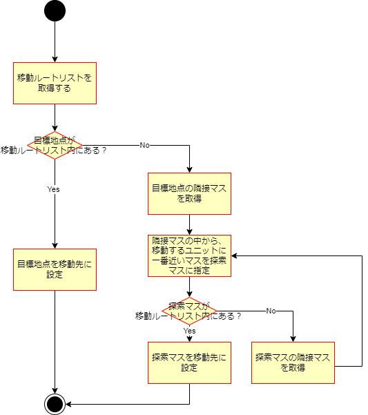
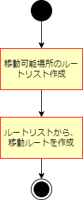
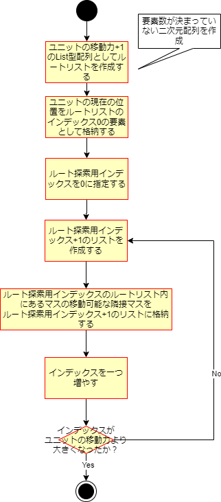
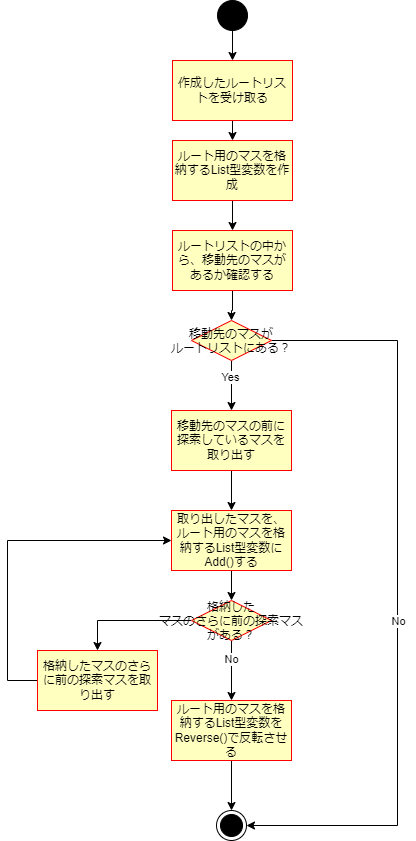

ナビゲーションAI設計
=====================================

ここではナビゲーションAI、主にユニットが移動する際のパス検索の詳細なアルゴリズムに関して示します

ユニットはある目標地点へ向けて移動することとなるので、  

- 目標地点からの移動先検索
- 移動先への移動ルート設定

の二つをここで説明します。

# 目標地点からの移動先検索

目標地点からの移動先を探す方法としては、目標地点から移動するユニットへ向かうような形で探します。
以下のようなアルゴリズムで行います。

検索方法としては深さ優先探索を行い、移動可能範囲の中にあるフィールドの場所に到達した時点で探索を終了し、
最後に到達した地点を移動先に決定します。

# 移動先への移動ルート設定

上記の方法で移動先を決定した後は、移動アニメーションを行うための、移動ルートの設定を行います。  

移動ルートに関しては、全ての移動可能場所へ行くルートを作成し、その中から最短距離で移動できる方法を選ぶ形で移動ルートを決定します。

## 全ての移動可能場所に対するルート作成

まずは、全ての移動可能場所へ行くルートの作成方法は下記のようになります。

上記のようなアルゴリズムにすることで、探索する際に通ったフィールドの場所を覚えておき、移動ルートを格納するList型配列を作ります。
探索する際に通ったフィールドのマスは、移動ルート決定を行う際に使用します。

例えば、移動力3のユニットがいた場合、生成される移動ルートの配列の中身は以下のようになります。
- インデックス0には1マス分移動することで到達可能な場所全て
- インデックス1には2マス分移動することで到達可能な場所全て
- インデックス2には3マス分移動することで到達可能な場所全て

## 移動ルート決定

次に、移動可能場所へ行くルートから、実際の移動ルートを決定します。下記のように決定します。

上記の通り、作成した移動可能場所に対するルートの配列から移動先の場所があるかを探索し、
そこから移動可能場所に対するルート作成時に探索した場所を、ルート探索時とは逆の順序でたどるような形で
移動ルートを決めます。