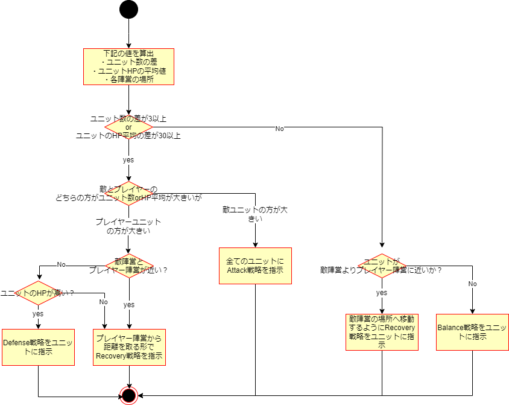

戦略家AI設計
===================================

ここでは敵ユニットへ指示を出す、戦略家AIについて説明します。  

- 戦略家AIはゲームデモ内にオブジェクトとしては存在しません。フィールド全体を見渡して大まかな方針を決め、その方針に沿って各敵ユニットへ戦略を指示します。
  - 方針は、フィールドから下記のデータを計算し、これを基に方針を決定します。
    - 敵ユニット数と味方ユニット数の差
    - プレイヤーのユニットのHPの平均と敵ユニットのHPの平均
    - プレイヤーのユニットの位置と敵ユニットの位置から計算するプレイヤー陣営と敵陣営(味方ユニットのユニット密度が高い場所と、敵ユニットのユニット密度が高い場所)の場所
    

下記に各ユニットへの戦略を決めるまでの流れを示します。

## 戦略家AIの思考フロー

- 戦略家AIは下記の図のようなフローで各ユニットに戦略を指定します。

- 上記の図の通り、大枠の戦略に関しては敵ユニット数と味方ユニット数の差とプレイヤーのユニットのHPの平均と敵ユニットのHPの平均が大きいかどうかで戦略を分岐させます。
  - 優勢の場合はさらに攻め込むように戦略を決めます
  - 劣勢の場合はプレイヤー陣営から距離を取るように戦略を決めます
  - 優勢でも劣勢でもない場合はプレイヤー陣営に踏み込み過ぎないように戦略を決めます
